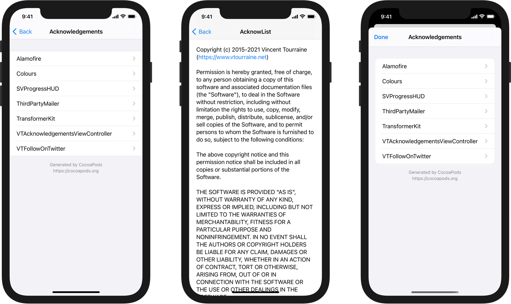
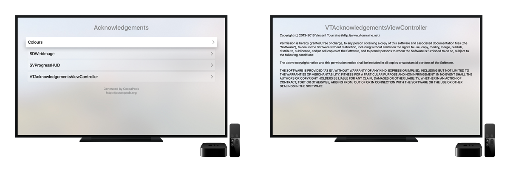

# VTAcknowledgementsViewController

Acknowledgements screen displaying a list of licenses, for example from [CocoaPods](https://cocoapods.org) dependencies.


[](https://travis-ci.org/vtourraine/VTAcknowledgementsViewController)
[](https://cocoapods.org/pods/VTAcknowledgementsViewController)
[](https://github.com/vtourraine/VTAcknowledgementsViewController/raw/master/LICENSE)

_Also available in Swift with [AcknowList](https://github.com/vtourraine/AcknowList)._



## Features

- Automatically load acknowledgments from CocoaPods-generated file
- Remove unnecessary line breaks from licenses for better text wrapping
- Optional list header and footer
- Tappable links in header, footer, and acknowledgment text
- Storyboard support
- Dark Mode support
- Dynamic Type support
- Localized in 12 languages

## Installation

CocoaPods is the most common solution to install this library.

1. Add `pod 'VTAcknowledgementsViewController'` to your `Podfile`.
2. Run `pod install`.
3. Add the `Pods-#target#-acknowledgements.plist` file generated by CocoaPods to your main target: drag and drop the file from the `Pods/Target Support Files/Pods-#target#/` folder in your Xcode project (don’t copy the file, leave `Copy items if needed` unchecked).

## Initialization

The `VTAcknowledgementsViewController` instance is usually pushed to an existing `UINavigationController`.

``` objc
VTAcknowledgementsViewController *viewController = [VTAcknowledgementsViewController acknowledgementsViewController];
[self.navigationController pushViewController:viewController animated:YES];
```

By default, the controller will try to guess the name of your `.plist` file, based on the bundle name (`Pods-#bundle-name#-acknowledgements.plist`). If that doesn’t match the file you’re looking for, you can initialize the view controller with a custom file name or path.

``` objc
viewController = [[VTAcknowledgementsViewController alloc] initWithFileNamed:@"Pods-MyTarget-acknowledgements"];
```

``` objc
NSString *path = [[NSBundle mainBundle] pathForResource:@"Pods-MyTarget-acknowledgements" ofType:@"plist"];
viewController = [[VTAcknowledgementsViewController alloc] initWithPath:path];
```

If you want to include licenses that are not part of a `plist` file, you can easily create new `VTAcknowledgement` instances, and use them for the acknowledgements array of the controller.

``` objc
VTAcknowledgement *customLicense = [[VTAcknowledgement alloc] initWithTitle:@"..." text:@"..." license:nil];
viewController = [[VTAcknowledgementsViewController alloc] initWithAcknowledgements:@[customLicense]];
```

## Customization

The controller can also display a header and a footer. By default, they are loaded from the generated `plist` file, but you can also directly change the properties values. If these texts contain a link, the view is tappable, and opens a browser with the URL.

``` objc
viewController.headerText = @"We love open source software.";
viewController.footerText = @"Powered by CocoaPods.org";
```

The controller title is a localized value for “acknowledgements”. You might want to use this localized value for the button presenting the controller.

``` objc
NSString *localizedTitle = [VTLocalization localizedTitle]; 
[button setTitle:localizedTitle forState:UIControlStateNormal];
```

By default, `VTAcknowledgementsViewController` uses the “grouped” table view style. You can choose a different style:

``` objc
viewController = [[VTAcknowledgementsViewController alloc] initWithAcknowledgements:@[] style:UITableViewStylePlain];
```

If you need to further customize the appearance or behavior of this library, feel free to subclass its classes.

## Apple TV

VTAcknowledgementsViewController is also compatible with tvOS for Apple TV apps.



## Requirements

VTAcknowledgementsViewController supports iOS 9.0 or tvOS 9.0 and above, and requires Xcode 11.0 and above. If you need lower requirements, look for an [older version of this repository](https://github.com/vtourraine/VTAcknowledgementsViewController/releases).

## Credits

VTAcknowledgementsViewController was created by [Vincent Tourraine](https://www.vtourraine.net), and improved by a growing [list of contributors](https://github.com/vtourraine/VTAcknowledgementsViewController/contributors).

## License

VTAcknowledgementsViewController is available under the MIT license. See the [LICENSE.md](./LICENSE.md) file for more info.
